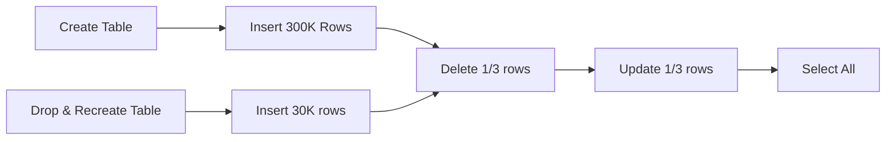

> Bài viết tập trung chủ yếu vào tối ưu hiệu năng của Variable Table bằng InMemory Optimized Table
> Do đó một ưu điểm vượt trội của InMemory Table là chống lock/latch sẽ không quá tập trung ở đây

## Về Temp/Variable Table

Chúng ta thường hay sử dụng nhất là Variable Table trong các Stored Procedure để lưu trữ tạm dữ liệu, phục vụ việc join
hoặc để trả về dữ liệu đã tổng hợp.

```sql
DECLARE @LOCAL_TABLEVARIABLE TABLE
    (column_1 DATATYPE, 
     column_2 DATATYPE, 
     column_N DATATYPE
    )
```

Ví dụ trên là cách khai báo rất phổ biến. Ở đây có một số thông tin ta cần xem xét trong cách dùng này:

#### Table Variable được lưu trữ ở TempDB

Với việc được tạo và lưu trong TempDB, Variable Table rõ ràng lưu Schema và Data xuống Disk

#### Table Variable có phạm vi sử dụng (Scope) trong batch

Tức là không thể sử dụng Variable ở ngoài Stored mà nó được định nghĩa.

Đối với TempTable (là kiểu khai báo ```#MyTable``` hay ```##MyTable```), phạm vi sử dụng có thể nằm ngoài Batch (
Procedure) mà nó được tạo.

Điều này cũng đồng nghĩa với việc **TableVariable định nghĩa ở Transaction A không thể được sử dụng trong Transaction
B**.

#### Table Variable có thể tạo với Index đi kèm

Đây là cách **tăng hiệu năng đáng kể** khi SELECT/JOIN với Table Variable, thông thường các Dev hay bỏ qua tính năng rất
quan trọng này.

```sql
DECLARE @TestTable TABLE
(
    Col1 INT NOT NULL PRIMARY KEY ,
    Col2 INT NOT NULL INDEX Cluster_I1 (Col1,Col2),
    Col3 INT NOT NULL UNIQUE
)
```

Như ví dụ trên ta có thể thấy, chúng ta có thể tạo CLUSTERED/NONCLUSTERED INDEX hay CONSTRAINT (NOT NULL/UNIQUE) với
Table Variable.

* Với một đặc điểm là LifeTime của TableVariable chỉ tồn tại trong ExecutionTime của Batch, ta cũng không quá quan tâm
  về việc maintain index như thế nào.

#### Tuy hỗ trợ Index nhưng SQLServer không maintain Statistic của TableVariable

Đặc điểm này rất quan trọng để ta hiểu một vấn đề rằng:

* TableVariable chỉ dành cho các trường hợp mà dữ liệu nhỏ. Tức là khi ta dùng TableVariable lưu trữ lượng lớn dữ liệu,
  sẽ gây ra vấn đề về hiệu năng khi mà SQLServer không thể estimate gần đúng số row sẽ trả về, dẫn đến việc sử dụng các
  operator không chính xác trong ExecutionPlan.

Riêng vấn đề này hiện có rất nhiều giải pháp, điển hình là **SQLServer 2019** đã thêm tính năng dự đoán chuẩn xác số
lượng row trả về -**Intelligent Query Processing (IQP)**) - cho TableVariable.

Hay chúng ta có thể dùng TempTable (```#MyTable``` hay ```##MyTable```) để thay thế TableVariable; 

Hoặc nữa là sử dụng queryHint ```OPTION(RECOMPILE)```.

Tuy nhiên các phương án này cũng lại phải đối mặt với các vấn đề hiệu năng khác.

Có thể chúng ta đi sâu vào vấn đề này ở một bài viết khác.

## In-Memory Optimized Table

Như ta biết ở trên thì TempTable hay TableVariable đều lưu trữ dữ liệu ở Disk.

Và vì thế để nâng cao hiệu năng, ta có thể hình dung tới một giải pháp cho phép sử dụng các loại Table này ở RAM/Memory.

Và giải pháp đó là **In-Memory Optimized Table**, được cung cấp ở SQLServer bắt đầu từ version 2014.

#### Các đặc điểm cơ bản của In-Memory Optimized Table (IMOT)

* Các dữ liệu của IMOT được lưu hoàn toàn ở Memory. Tuy nhiên SQLServer vẫn lưu cả Data/Log xuống đĩa để đảm bảo tính
  Durability (ACID) của dữ liệu.
* Không đọc/ghi dữ liệu vào TempDB, tính toán hoàn toàn trên Memory.
* Có 2 option cho việc ghi dữ liệu xuống Disk (như đã nói ở trên): **SCHEMA_ONLY** & **SCHEMA_AND_DATA**
* Yêu cầu thêm phần cứng (Disk/RAM) để lưu dữ liệu.
* Yêu cầu có **ít nhất 1 INDEX** khi tạo Table. Hỗ trợ 2 loại Index là HASH và NONCLUSTERED.

> Ở đây ta tập trung vào việc chuyển đổi từ TableVariable sang InMemory Table
> Bỏ qua việc thay thế/so sánh giữa TempTable và InMemory Table

#### Điều kiện tiên quyết để sử dụng IMOT

Để đảm bảo tính Durability (một phần của ACID): Một khi transaction đã commit, DB phải đảm bảo là nó đã commit (ghi log,
ghi data xuống đĩa);

* Điểm khác biệt với Table bình thường đó là với IMOT, khi transaction đã commit, vẫn có thể mất Data trong trường hợp
  ta chỉ ghi Log (SHEMA_ONLY)

Do có khác nhau về tính ACID, ta bắt buộc PHẢI cung cấp một FILEGROUP mới cho IMOT. Đây chính là chi phí phát sinh trên Disk:

```sql
ALTER DATABASE EASYBOOKS
    ADD FILEGROUP EasyBooks_InMemoryData
        CONTAINS MEMORY_OPTIMIZED_DATA;
GO
ALTER DATABASE EASYBOOKS
    ADD FILE (NAME = 'EasyBooks_InMemoryData',
        FILENAME = 'D:\Data\EasyBooks_InMemoryData.ndf')
        TO FILEGROUP EasyBooks_InMemoryData;
GO
```

Từ đây ta mới có thể tạo InMemory Optimized Table.

#### Chuyển đổi Table Variable sang InMemory Optimized Table

```sql
DECLARE @tvTableD TABLE  
    ( Column1   INT   NOT NULL ,  
      Column2   CHAR(10) );
```

Kiểu khai báo truyền thống như trên không hỗ trợ InMemory Optimized. Thay vào đó ta thay đổi cú pháp như sau, và có thể
chỉ cho SQLServer nó là IMOT:

```sql
CREATE TYPE dbo.typeTableD  
    AS TABLE  
    (  
        Column1  INT   NOT NULL   INDEX ix1,  
        Column2  CHAR(10)  
    )  
    WITH  
        (MEMORY_OPTIMIZED = ON)
```

Như trên ta thấy, IMOT cần một INDEX, trong trường hợp này ```ix1``` là NONCLUSTERED INDEX.

## Đánh giá hiệu năng để thấy ưu điểm của việc chuyển đổi

Kịch bản thực hiện như sau trên cả TableVariable và InMemory Optimized Table:

* Tạo bảng và INSERT 300K ROWS.
* DELETE 100K ROWS.
* UPDATE 100K ROWS.
* SELECT ra tất cả các ROW còn lại.
* Thử lại với chỉ 30K ROWS để so sánh khi dữ liệu nhỏ hơn.



Ở mỗi phương án, ta in ra thời gian thực hiện Batch, bởi vì với IMOT không có thông tin tổng thời gian kể cả ta bật ```STATISTICS TIME```

#### Thử nghiệm với InMemory Optimized Table

```sql
-- IN-MEMORY OPTIMIZED TABLE TEST
CREATE TYPE TestMemTyp AS TABLE
(
    Id      INT PRIMARY KEY NONCLUSTERED IDENTITY (1,1),
    Column1 INT,
    Column2 CHAR(10)
) WITH
(
    MEMORY_OPTIMIZED = ON
);

DECLARE @dateString_Begin nvarchar(64) =
    Convert(nvarchar(64), GetUtcDate(), 121);
PRINT Concat(@dateString_Begin, '  = Begin time, _mem.');
GO

DECLARE @TestMemOptVar AS TestMemTyp ;
-- INSERT 300K ROWS
DECLARE @Counter INT
SET @Counter = 1
WHILE (@Counter <= 300000)
    BEGIN
        INSERT INTO @TestMemOptVar (Column1, Column2) values (1, 2);
        SET @Counter = @Counter + 1
    END

-- DELETE 1/3 ROWS
DELETE FROM @TestMemOptVar WHERE Id <= 100000;

-- UPDATE 1/3 ROWS
UPDATE @TestMemOptVar SET Column2 = 0 WHERE Id <= 100000;

-- SELECT ALL FINALLY
SELECT * FROM @TestMemOptVar;

-- RUN THIS BATCH TWICE
GO 2

DROP TYPE TestMemTyp;

DECLARE @dateString_End nvarchar(64) =
    Convert(nvarchar(64), GetUtcDate(), 121);
PRINT Concat(@dateString_End, '  = End time, _mem.');
```

Lưu ý, batch chính của chúng ta chạy với lệnh ```GO 2```, tức là yêu cầu SSMS chạy 2 lần batch này.

Kết quả thu được, tổng thời gian là **11846ms** 

```
2021-05-12 08:02:14.147  = Begin time, _mem.
Beginning execution loop

Batch execution completed 2 times.
2021-05-12 08:02:25.993  = End time, _mem.
```

#### Thử nghiệm với Table Variable

```sql
--REGULAR TABLE VARIABLE TEST
CREATE TYPE TestDiskTyp1 AS TABLE
(
    Id      INT PRIMARY KEY NONCLUSTERED IDENTITY (1,1),
    Column1 INT,
    Column2 CHAR(10)
)

DECLARE @dateString_Begin_1 nvarchar(64) =
    Convert(nvarchar(64), GetUtcDate(), 121);
PRINT Concat(@dateString_Begin_1, '  = Begin time, _disk.');
GO

DECLARE @TestDiskOptVar AS TestDiskTyp1 ;
-- INSERT 300K ROWS
DECLARE @Counter INT
SET @Counter = 1
WHILE (@Counter <= 300000)
    BEGIN
        INSERT INTO @TestDiskOptVar (Column1, Column2) values (1, 2);
        SET @Counter = @Counter + 1
    END

-- DELETE 1/3 ROWS
DELETE FROM @TestDiskOptVar WHERE Id <= 100000;

-- UPDATE 1/3 ROWS
UPDATE @TestDiskOptVar SET Column2 = 0 WHERE Id <= 100000;

-- SELECT ALL FINALLY
SELECT * FROM @TestDiskOptVar;

-- RUN THIS BATCH TWICE
GO 2

DROP TYPE TestDiskTyp1;

DECLARE @dateString_End_1 nvarchar(64) =
    Convert(nvarchar(64), GetUtcDate(), 121);
PRINT Concat(@dateString_End_1, '  = End time, _mem.');
```

Hoàn toàn với thủ tục tương tự như trên, tổng thời gian là **17520ms**

```
2021-05-12 08:03:17.517  = Begin time, _disk.
Beginning execution loop

Batch execution completed 2 times.
2021-05-12 08:03:35.037  = End time, _mem.
```

#### Thử nghiệm với trường hợp dữ liệu bé hơn: 30K rows

Thay vì 300K rows như trên, ta thử với chỉ 30K rows:

```sql
...
WHILE (@Counter <= 30000)
...
WHERE Id <= 10000;
...
```

Kết quả với **In-Memory Optimized Table** là **1873ms**:

```
2021-05-12 08:15:17.377  = Begin time, _mem.
Beginning execution loop

Batch execution completed 2 times.
2021-05-12 08:15:19.250  = End time, _mem.
```

Kết quả với **Table Variable** là **2477ms**

```
2021-05-12 08:16:31.410  = Begin time, _disk.
Beginning execution loop

Batch execution completed 2 times.
2021-05-12 08:16:33.887  = End time, _mem.
```

#### Kết quả thử nghiệm

* Với trường hợp dữ liệu lớn, 300K rows, IMOT nhanh hơn TableVariable **5,5s**

* Với trường hợp dữ liệu nhỏ hơn, 30K rows, IMOT nhanh hơn TableVariable **0.6s**

Như vậy có thể thấy với trường hợp lượng dữ liệu đang xử lý rất nhỏ thì ta không cần thiết phải chuyển đổi qua IMOT, vì phát sinh chi phí về Disk/RAM cũng như phải thay đổi Code.

Tuy nhiên trong trường hợp dữ liệu lớn, nên sử dụng IMOT thay thế cho TableVariable.

Trong các tình huống cần sử dụng TableVariable, đa phần ta chỉ tạo và sử dụng trong Stored Procedure, vậy nên nếu thay thế bằng InMemory Optimized Table, hết batch ta hoàn toàn có thể DROP TYPE/TABLE.

Điều này giúp giảm chi phí phát sinh trên RAM mà vẫn đạt được sự cải thiện về hiệu năng.

> Như đã nói từ đầu, trong tình huống này ta chỉ xem xét khả năng thay thế TableVariable bằng InMemory Optimized Table. 
> Ngoài ra, InMemory Optimized Table còn có nhiều ưu điểm vượt trội nữa, đặc biệt là khả năng chống LOCK/DEADLOCK.

## Tham khảo

[https://docs.microsoft.com/en-us/sql/relational-databases/in-memory-oltp/faster-temp-table-and-table-variable-by-using-memory-optimization?view=sql-server-2017](https://docs.microsoft.com/en-us/sql/relational-databases/in-memory-oltp/faster-temp-table-and-table-variable-by-using-memory-optimization?view=sql-server-2017)

[https://www.sqlshack.com/memory-optimized-table-variables-in-sql-server/](https://www.sqlshack.com/memory-optimized-table-variables-in-sql-server/)

[https://stackoverflow.com/questions/58858515/sql-server-memory-optimized-table-poor-performance-compared-to-temporary-table](https://stackoverflow.com/questions/58858515/sql-server-memory-optimized-table-poor-performance-compared-to-temporary-table)

[https://www.red-gate.com/simple-talk/sql/sql-development/beginner-guide-to-in-memory-optimized-tables-in-sql-server/](https://www.red-gate.com/simple-talk/sql/sql-development/beginner-guide-to-in-memory-optimized-tables-in-sql-server/)
